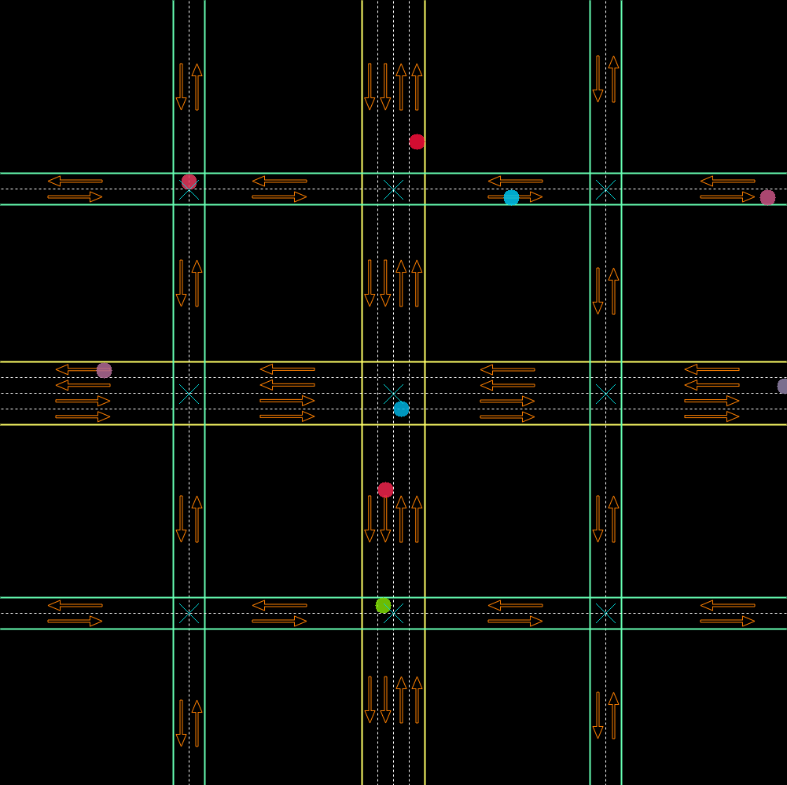

# Mark Simulator
Small simulator of cars in a map for didactic purposes. Final project of Udacity C++
nanodegree.

### Requirements
- OpenCV >= 4.1
- C++ 17

### Classes
* **TrafficObject**: Base generic class that other class will implement.
* **Graphics**: Responsible to render the simulation.
* **Lane**: The smaller part of the street that helps the vehicles to control their
  positions.
* **Street**: Contains some lanes and basically connects two different intersections.
  Some streets are called loop streets because they connects the limits of the image.
* **Intersection**: Simulates the intersections and are used by the vehicles as
  references.
* **Vehicle**: Moves along the simulation with a simple behavior: with a intersection as
  a destination, pick a lane that go to it and move. When it enters in the target
  destination, it chooses a random street to the set the next intersection as
  destination.
